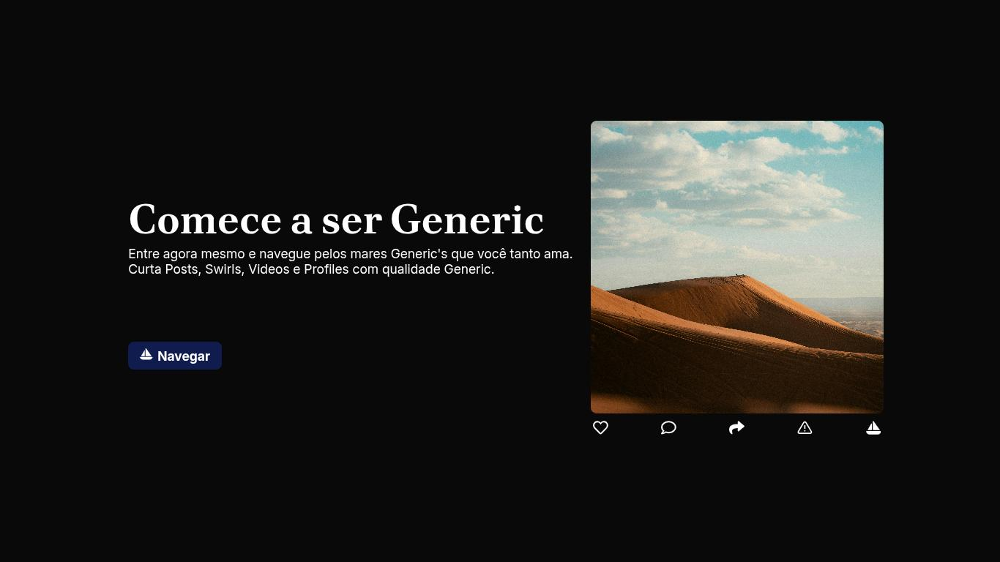
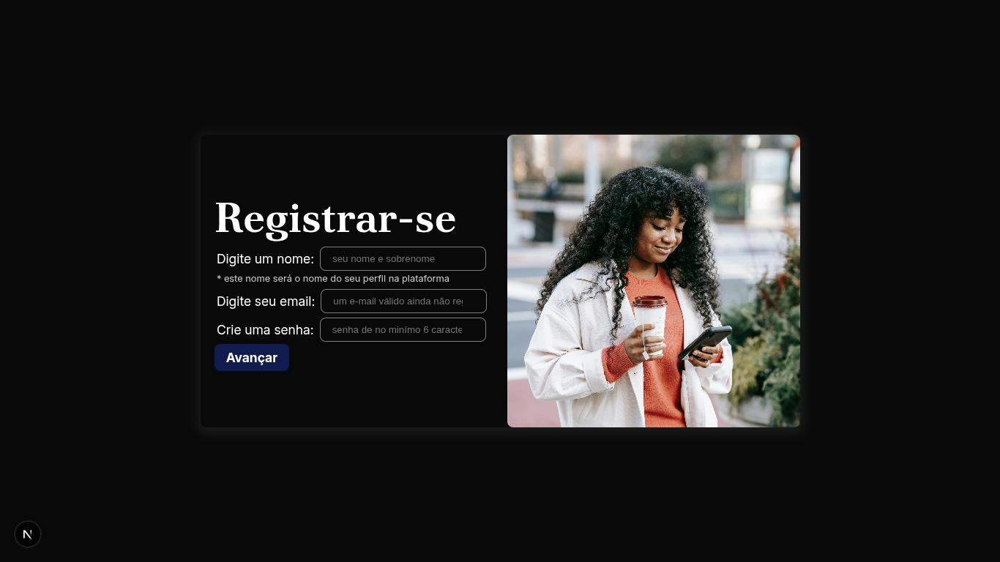
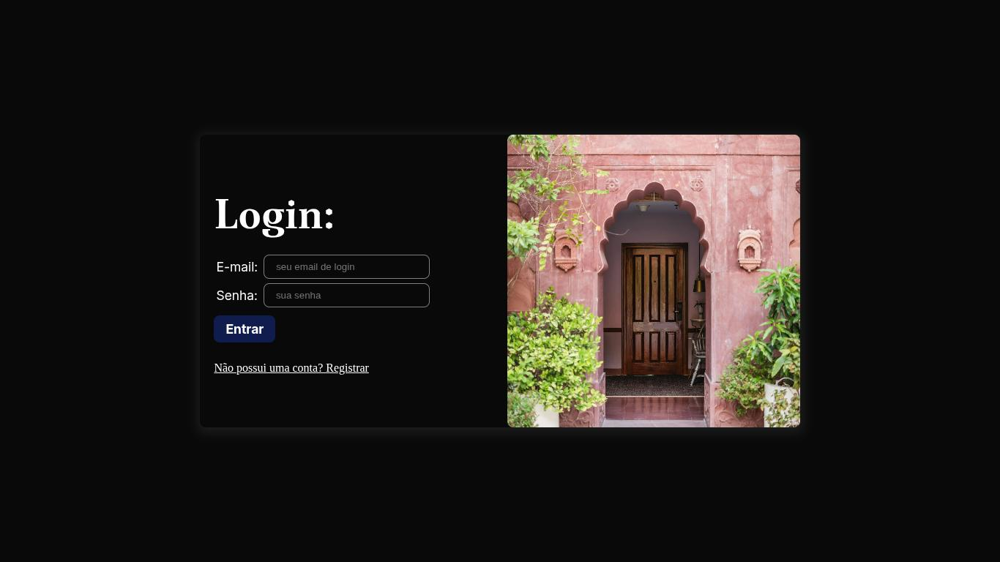
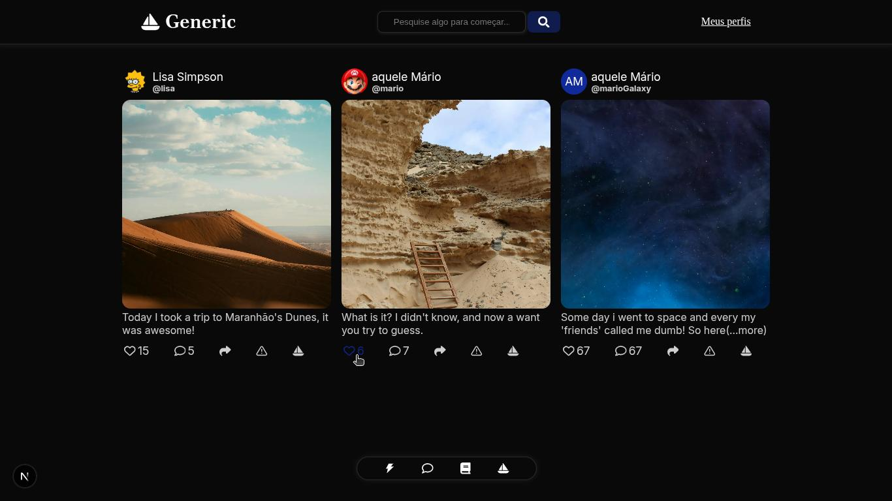

# Generic

## O que foi feito até aqui?

### Home:

Página inicial que convoca os usuários a serem Generic.

### Registro:

Tela atual de registro, já conectada aos endpoints da api. Completamente funcional para cadastrar usuários.

### Login:

Tela atual de login, já conectada aos endpoints da api.Funcional para logar em sua conta.

### Login:

Tela *atual de feed usando dados mockados

### Outras páginas:

    /about = Com informações sobre a Generic e o Projeto.
    
    /not-found = Página de páginas não encontradas

Acompanhe o Progresso aqui

